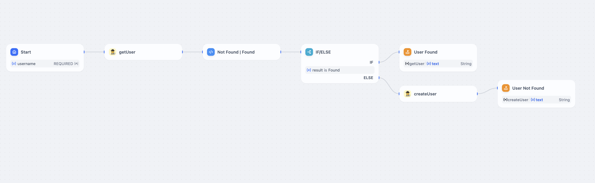

# Dify Tools Worker

## Description

This is an example repository for a worker that can be used in the Dify Tools.

## Get Started

For **basic** usage, you can use the [Basic Template](./docs/basic.md).

```
git checkout v1.0
``` 

For more **advanced** usage, you can use the [Global Storage](./docs/global_store.md)



## Quote then Run

This fork adds two endpoints that let you preview token usage and cost before running an LLM call:

- `POST /quote` – estimate tokens and price; returns a `quote_id`.
- `POST /confirm` – run the quoted request only after approval.

Quotes are stored in a KV namespace for 15 minutes. Pricing is configured via the `PRICING_JSON` variable.

### Streamlit helper

`streamlit_app.py` provides a minimal UI where you can duplicate prompt blocks to run multiple quotes in parallel.

