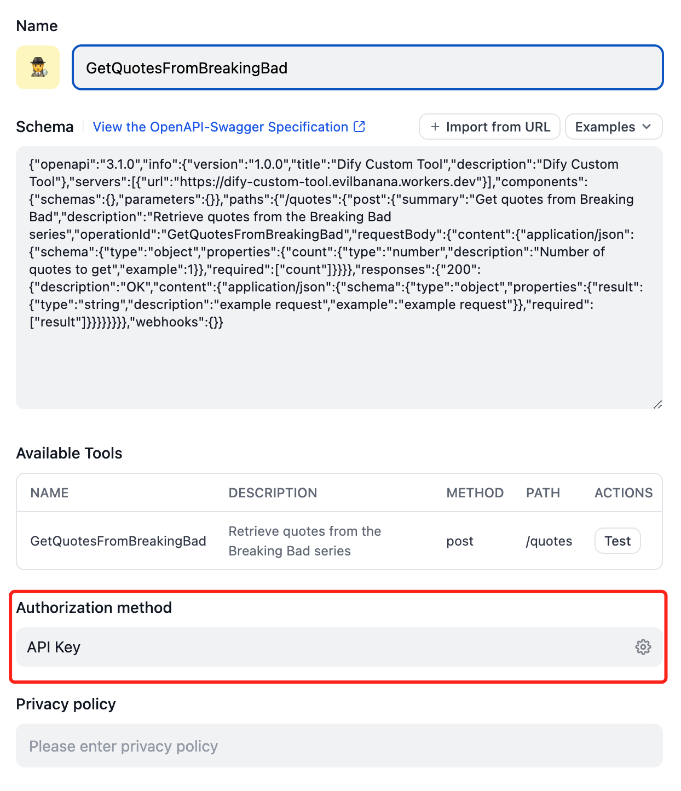
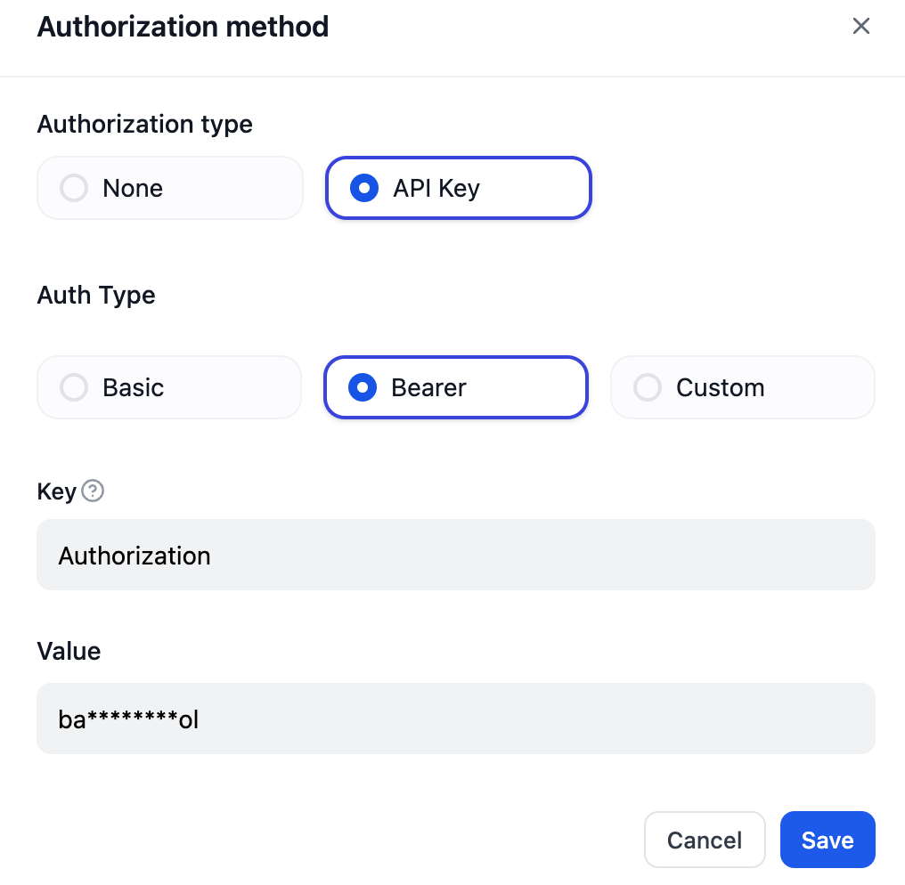

# Dify Tools Worker

## Description

This is a cloudflare worker that is used to create a tool for dify app.

## Before you start

### Features it provides

- **OpenAPI Documentation**: It provides OpenAPI documentation for the tool.
- **Beaer Token**: It provides a beaer token to authenticate the request.
- **Endpoint**: It provides an endpoint to get the quotes from the Breaking Bad series.

### The doc's route

This defines the route to generate OpenAPI **(Not OpenAI)** documentation.

```typescript
app.doc31("/doc", (c) => ({
  openapi: c.env.OPENAPI_VERSION,
  info: {
    version: c.env.TOOL_VERSION,
    title: c.env.TOOL_NAME,
    description: c.env.TOOL_DESCRIPTION,
  },
  servers: [{ url: new URL(c.req.url).origin }],
}));
```

### The schema for request and response

```typescript
const reqSchema = z.object({
  count: z.number().openapi({ example: 1, description: "Number of quotes to get" }),
});

const resSchema = z.object({
  result: z.string().openapi({ example: "example request", description: "example request" }),
});
```

You can modify the `reqSchema` to fit your needs. It uses [zod]() to validate the request body. Typically, you don't need to modify the `resSchema` as it is used to generate a string response. It should be something like this:

```json
{
  "result": "example request"
}
```

### The route

This defines the route to get the quotes from the Breaking Bad series. It uses the `reqSchema` and `resSchema` to validate the request and response body.

- `method`: The HTTP method to use **(required)**
- `path`: The path to use for the route **(required)**
- `operationId`: The operation id to use and it will be the tool's name in Dify console. **(required)**
- `summary`: The summary to use and it will be the tool's description in Dify console **(required)**
- `description`: The description to use. **(optional)**

```typescript
const quoteRoute = createRoute({
  method: "post",
  path: "/quotes",
  operationId: "GetQuotesFromBreakingBad", // required
  summary: "Get quotes from Breaking Bad", // required
  description: "Retrieve quotes from the Breaking Bad series",
  request: {
    body: {
      content: {
        "application/json": { schema: reqSchema },
      },
    },
  },
  responses: {
    200: {
      content: {
        "application/json": { schema: resSchema },
      },
      description: "OK",
    }
  },
});
```

### The Beaer Token

This is used to authenticate the request. It uses the `bearerAuth` middleware to verify the token. You can modify the `verifyToken` function to fit your needs.
You can set the TOKEN in the `wrangler.toml` file.
```typescript
app.use(
  quoteRoute.path,
  bearerAuth({
    verifyToken: async (token, c) => {
      return token === c.env.TOKEN
    },
  })
);
```
### The handler

> This is quite simple. It just fetches the quotes from the Breaking Bad API and returns the result. Make sure the response body is valid according to the `resSchema`. 

```typescript
app.openapi(quoteRoute, async (c) => {
  const { count } = c.req.valid("json");
  const url = `https://api.breakingbadquotes.xyz/v1/quotes/${count}`;
  const result = await fetch(url).then((res) => res.text());
  return c.json({ result });
});
```

## Development

```sh
cp .wrangler.toml.example .wrangler.toml
npm install
npm run dev
# You will get a url like this: http://localhost:8787
```

## Deployment

```sh
npm run deploy 
# You will get a url like this: https://difytoolsworker.yourname.workers.dev
```

## Things needs to fill in Dify console

- Click the `Create Tool` button
- Click the `Import from URL ` button
- Fill in the `https://difytoolsworker.yourname.workers.dev/doc`
- Setup the `Authorization` like below
  - 
  - 
- Wala! You have created a tool in Dify console


## License

MIT
